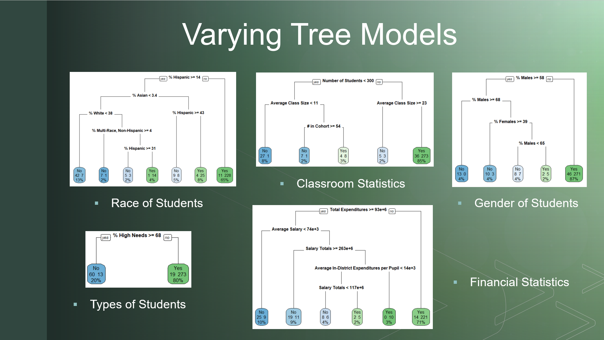

***

### Informal Question: Is there a recipe for the perfect high school?

***

### Proposal
The foundation of this project is to find evidence that supports the idea that graduation rate can be predicted.

### Common Belief
Currently the most widely held belief among parents and teachers is that the classroom size and individual teachers make the largest difference in whether a student graduates or not. Having taught in an inner city high school for a year, I have to agree with these beliefs however, I haven't seen any hard evidence to say this with any confidence.

### Outline

1. Data Source & Description  
2. Cleaning the Data  
3. Exploratory Data Analysis  
4. Principal Component Analysis  
5. Tree Models  
6. Major Findings  
7. Conclusion  

I will detail the data source I used, followed by what I did to clean and filter the data for my specific goal. I will then briefly discuss some general statistics surrounding the formatted data set, and conduct Principal Component Analysis to group the variables based on the largest variance. This will be followed by a more focused learning method, tree models, which will lead into my major findings and conclusions.

***

# Reading in the Data Set

```{r Reading in the Data Set, message=FALSE}
library(readr)
MA_Public_Schools_2017 <- read_csv("../Data/MA_Public_Schools_2017.csv")
View(MA_Public_Schools_2017)
```

### The Data
I found the data set on Kaggle, titled Massachusetts Public Schools Data. It was compiled by Nigel Dalziel and is actually available online through the State Report shown here. The only difference being that it is in numerous pieces so can be tedious to collate all of the data into one report.


### Description
In terms of the actual data, the data set is correct as of August 2017 and contains a list of public schools in Massachusetts with their respective information. Specifically there are 1861 schools in the report with 302 variables detailing each school. Variables include enrollment by gender and race, class sizes, teacher salaries, graduation rate, test scores, and much more. Note that there is only one record per school, so in this data set I cannot compare the performance of schools over time.

***

# Cleaning the Data

### Step 1
First I filtered the data to only include traditional four year high schools by searching for records whereby the enrollment for grades 9, 10, 11 and 12 are greater than 0. 

```{r Cleaning the Data - Step 1}
# Creating a duplicate of the original data set to then filter and modify
Public_Schools_Subset<-MA_Public_Schools_2017[,]
# Removing all schools that have no enrollment for 9th, 10th, 11th or 12th Grade
Public_High_Schools_Subset<-Public_Schools_Subset[which(Public_Schools_Subset$`9_Enrollment`>0 & Public_Schools_Subset$`10_Enrollment`>0 & Public_Schools_Subset$`11_Enrollment`>0 & Public_Schools_Subset$`12_Enrollment`>0),]
```

### Step 2
Secondly, since I am looking at finding variables to determine graduation rate, I removed records with a missing graduation rate as opposed to imputing those values.

```{r Cleaning the Data - Step 2}
# Removing records that have a missing field for Graduation Rate
Public_High_Schools_Subset<-Public_High_Schools_Subset[complete.cases(-Public_High_Schools_Subset$`% Graduated`), ]
```

### Step 3
With my intentions being to create a decision tree, I then created a binary yes/no variable to indicate whether graduation rate was greater than 80%. I chose this value based on the average graduation rate in the data set. Above 80% indicates the school is performing above average compared to other schools in Massachusetts. 

```{r Cleaning the Data - Step 3}
# Creating a binary variable for Graduation Rate greater than or equal to 80%
Public_High_Schools_Subset$Graduation_80_Percent<-ifelse(Public_High_Schools_Subset$`% Graduated`>=80, 'Yes', 'No')
```

### Step 4
Lastly, I removed unnecessary variables such as testing scores, college acceptance etc. The information was interesting, however, it was not relevant for the scope of this project.

```{r Cleaning the Data - Step 4}
# Removing unecessary variables
Public_High_Schools_Subset<-Public_High_Schools_Subset[,c(-1,-4,-5,-6,-7,-9,-11,-12,-15:-25,-32,-34,-36,-38,-40,-71:-302)]
```

### Final Data Set

```{r Dimensions of Final Data Set}
# Printing the dimensions of the final data set
dim(Public_High_Schools_Subset)
```

So, in terms of the final data set, there are 365 high schools, with 47 plausible variables that impact graduation rate.

```{r}
# Changing string variables to factors to summarize
Public_High_Schools_Subset$`School Name`<-as.factor(Public_High_Schools_Subset$`School Name`)
Public_High_Schools_Subset$`School Type`<-as.factor(Public_High_Schools_Subset$`School Type`)
Public_High_Schools_Subset$Town<-as.factor(Public_High_Schools_Subset$Town)
Public_High_Schools_Subset$`District Name`<-as.factor(Public_High_Schools_Subset$`District Name`)
Public_High_Schools_Subset$Graduation_80_Percent<-as.factor(Public_High_Schools_Subset$Graduation_80_Percent)

# Summarizing the cleaned data set
summary(Public_High_Schools_Subset)
```

Moving on to the exploratory data analysis, I was initially concerned that my cleaned data set was going to lack variation due to its size. However, based on the following findings, I felt comfortable that there was enough variety to find interesting conclusions in the data. For example within high schools:

* The proportion of students defined as High Needs varies from 11.70% to 100%
* The proportion of students defined as economically disadvantaged varies from 3.1% to 93%
* The proportion of white students varied from 0.6% to 97.60%. Males from 28.2% to 88.6%
* Class sizes from 4 students to 34 students
* Lastly the target variable, graduation rate varied from 8.7% to 100%.

These are the variables I instinctively thought may impact graduation rate, so having variation to study means the conclusions can be more generalized.

### How many schools are above 80% Graduation Rate?

```{r}
# Calculating proporion of records with graduation above 80%
prop.table(table(Public_High_Schools_Subset$Graduation_80_Percent))
# Approximately 22% of my data set falls below 80% graduation rate, 78% are equal to or above it
```

***

# Clustering Model

### Purpose and Method
In order to get a better grasp on the types of schools within this data set I used a cluster model and highlighted the distinguishing features of each group. I chose principal component analysis to form my groups since this is the method I am most comfortable with. I could have also chosen k-mode since my final variables are all numeric. As I said I wanted to see the types of schools, but I also wanted to see if there were any interesting relationships between variables. For this model, I based the number of groups both on the scree plot and on the percentage of variance accounted for being greater than 80% to prevent a loss of variance.

### Preparation for Principal Component Analysis

```{r Preparation for Principal Component Analysis}
# Checking structure of Subset
str(Public_High_Schools_Subset)

# Removing character variables
Public_High_Schools_Subset_PCA<-Public_High_Schools_Subset[,c(-1:-6,-47)]

# Removing Missing Records
Public_High_Schools_Subset_PCA<-na.omit(Public_High_Schools_Subset_PCA)

# Preventing numbers from being displaying in scientific notation
options(scipen = 999)
```

### Conducting Principal Component Analysis

```{r Conducting Principal Component Analysis}
# Conducting PCA
principal_component_analysis_normalized<-prcomp(Public_High_Schools_Subset_PCA, scale. = T)

# Summary of PCA
summary(principal_component_analysis_normalized)
# Result: There are 40 principal components because there are 40 variables
# Result: Principal Component 1 accounts for 32.01% of the variation
# Result: Principal Component 2 accounts for 22.98% of the varation
# Result: Principal Component 3 accounts for 9.98% of the variation
# Result: Principal Component 4 accounts for 5.89% of the varation
# Result: Principal Components 1 through 4 cumulitatively account for 70.86% of the variation
```

### Visually Displaying Variance

```{r Displaying Variance}
# Bar Chart showing Principal Components accounting for Variance
principal_components_variance<-(principal_component_analysis_normalized$sdev^2 / sum(principal_component_analysis_normalized$sdev^2))*100
barplot(principal_components_variance, las=2, xlab="Principal Component", ylab="% Variance Explained", main="Principal Components versus Percent of Variance Explained")

# Scree Plot to determine Optimal Principal Components
screeplot(principal_component_analysis_normalized, type="line")
# Result: Elbow located at 4 principal components
```

Based on the scree plot and the cumulitative accounted variance, I have chosen to work with the first 8 principal components because this accounts for 82.02% of the variance within the data set.

### Observing Loading Weights for PCA

```{r}
# Observing Loading Weights for PCA
options(max.print=1000000)
principal_component_analysis_normalized$rotation[,1:8]

# Result: PC1 = Positive (% White, % Graduated)
# Result: PC1 = Negative (% High Needs, % Economically Disadvantaged)
# Interpretation = High Performing Public Schools in Affluent Areas

# Result: PC2 = Positive (% White)
# Result: PC2 = Negative (Total Enrollment, Number of Students)
# Interpretation = Public Schools in Affluent Areas

# Result: PC3 = Positive (% Females, Average Class Size, % Graduated)
# Result: PC3 = Negative (% Students with Disabilities, % Dropped Out, % Non-Grad Completers)
# Interpretation = High Performing Public Schools in Afluent Neighborhood

# Result: PC4 = Positive (% Females, Average Class Size)
# Result: PC4 = Negative (% Native American, % Multi-race, Average Expenditures per Pupil)
# Interpretation = Public Schools in Afluent Neighborhood

# Result: PC5 = Positive (% Hispanic, % Permanently Excluded)
# Result: PC5 = Negative (% Mutli-race)
# Interpretation = Inner City Public Schools

# Result: PC6 = Positive(% Students with Disabilities, High Needs, % Males, Average Salary)
# Result: PC6 = Negative(Hispanic, First Language Not English)
# Interpretation = Special Education Schools

# Result: PC7 = Positive(% Students with Disabilities, % Non-grad Completers)
# Result: PC7 = Negative(% Permanently Excluded, % GED, % Multi-race)
# Interpretation = Challenging Special Education Schools

# Result: PC8 = Positive(% Asian, % First Language Not English, % Non-grad Completers)
# Result: PC8 = Negative(% Permanently Excluded, Native American)
# Interpretation = Schools with High Rate of Foreign Exchange Students
```

As cluttered as this appears, it does have significant value in how I proceeded. Simply put, I found myself listing the stronger variables for a group and weaker variables for a group, and then placing my interpretation on what the school might look like. For example, in the first group the schools have a high percentage of white students and a high graduation rate. Whilst having a low percentage of high needs and economically disadvantaged students. My initial assumption was that these are private schools but this data set only contains public schools. This made me reflect hard about what actually defines a school, because currently I am labeling groups based on my experience and prejudice, as opposed to hard facts. So I changed my biased interpretation to high performing public schools in affluent areas. I did the same for the other groups however I noticed a few things.

### Key Takeaway 1
In the first group, a high percentage of white students is grouped with a high graduation rate.

### Key Takeaway 2
In the third group a high female population and average class size is also linked to a high graduation rate.

### Key Takeaway 3
In the fifth group a high Hispanic population is grouped with a high percentage of students being permanently excluded. These are valuable insights moving forward because I'm expecting graduation rate to be linked to gender and race which sounds terrible because how can you control these within a school. Shouldn't I be excluding them? After thinking hard and long about this I decided that these variable do define schools, as unfair as it may seem, the reality is that many schools are defined by race and gender. Being aware of this moving forward, changes how I approach decision trees in the next section.

### Key Takeaway 4
Lastly, this simple clustering exercise also highlighted the fact that I have correlated variables. Of course if the total enrollment is low, the number of students will also be low.

***

# Tree Models

### Purpose
I chose to model this data using decision trees because I believe they are the most visually intuitive modeling method for individuals outside of the data analytics world. Furthermore, I'm looking for groups of schools that are succeeding or failing. Tree Models have a structure such that the first node symbolizes the most affective variable on the target variable which in essence allows specific variables to be targeted for improvement.

### Varying Tree Models
Given the complexity of how schools can be defined, instead of making one single decision tree. I decided to break up the groups into categories for further analysis. Furthermore, the following trees use every record in the data set, in other words there are no test and training sets due to how small the set is to begin with and wanting to see as many variations as possible.

### Preparing Data for Tree Model

```{r Preparing Data for Tree Model, warning=FALSE}
# Removing all identifying variables (i.e. name, location etc.)
Total_Public_High_Schools_Subset<-Public_High_Schools_Subset[,c(-1:-6,-40:-46)]

# Loading packages needed to plot tree diagrams
library(rpart)
library(rpart.plot)
```

### First Tree Model - All Variables

```{r}
# Creating Tree with all non-identifying unique variables
set.seed(123)
graduation_total_rpart <- rpart(Total_Public_High_Schools_Subset$Graduation_80_Percent~., method="class", parms = list(split="gini"), data=Total_Public_High_Schools_Subset)
rpart.plot(graduation_total_rpart, type=0, extra=101)
```

This first model contains all of the variables and it shows that the most dominant variable determining graduation rate is the percentage of students with high needs, followed by economically disadvantaged, expenditures and so fourth. This was my initial tree and I had a hard time justifying changes based on this model. For example if I was presenting this to a new high school principal, their first argument would be that my model shows only high graduation rates for schools with percentages of high need students lower than 68%. Furthermore, the lower nodes filter by the types of students which are not actionable steps. A public school can't necessarily control the gender, special enrollment or students with disabilities.

### Second Tree Model - Race

```{r Tree Model - Race}
# Creating a High School Subset that only contains race and graduation rate
Race_Public_High_Schools_Subset<-Public_High_Schools_Subset[,c(-1:-17,-25:-46)]

# Creating Tree Diagram for Race
set.seed(123)
graduation_race_rpart <- rpart(Race_Public_High_Schools_Subset$Graduation_80_Percent~., method="class", parms = list(split="gini"), data=Race_Public_High_Schools_Subset)
rpart.plot(graduation_race_rpart, type=0, extra=101)
# Result: Major Variable = % Hispanic, % Asian
```

Just looking at the race of students to determine graduation rate, if the Hispanic population within a school is lower than 14% then the school is likely to have a graduation rate higher than 80%. Without my cluster analysis, I would have struggled to justify this seemingly concrete finding. From the last slide we saw that a high Hispanic population is grouped with a high exclusion rate.

### Third Tree Model - Gender

```{r Tree Model - Gender}
# Creating a High School subset that only contains classroom gender and graduation rate
Gender_Public_High_Schools_Subset<-Public_High_Schools_Subset[,c(-1:-24,-27:-46)]

# Creating Tree Diagram for Gender
set.seed(123)
graduation_gender_rpart <- rpart(Gender_Public_High_Schools_Subset$Graduation_80_Percent~., method="class", parms = list(split="gini"), data=Gender_Public_High_Schools_Subset)
rpart.plot(graduation_gender_rpart, type=0, extra=101)
# Result: Major Variable = % Males, % Females
```

The tree diagram by gender highlights the same concept as the cluster model. A high percentage of females leads to a high graduation rate. Part of me wonders if this because females are smarter than males or if females are less likely to be excluded and are more focused on graduation.

### Fourth Tree Model - Student Type

```{r}
# Creating a High School subset that only contains student type and graduation rate
Type_Public_High_Schools_Subset<-Public_High_Schools_Subset[,c(-1:-12,-18:-46)]

# Creating Tree Diagram for Student Type
set.seed(123)
graduation_type_rpart <- rpart(Type_Public_High_Schools_Subset$Graduation_80_Percent~., method="class", parms = list(split="gini"), data=Type_Public_High_Schools_Subset)
rpart.plot(graduation_type_rpart, type=0, extra=101)
# Result: Major Variable = % High Needs
```

The types of students within schools highlights this idea that general public schools are not capable to handling students with high needs, therefore large numbers of high needs students leads to a lower graduation rate.

### Fifth Tree Model - Classroom Statistics

```{r}
# Creating a High School subset that only contains classroom statistics and graduation rate
Classroom_Public_High_Schools_Subset<-Public_High_Schools_Subset[,c(-1:-27,-30:-38,-40:-46)]

# Creating Tree Diagram for Classroom Statistics
set.seed(123)
graduation_classroom_rpart <- rpart(Classroom_Public_High_Schools_Subset$Graduation_80_Percent~., method="class", parms = list(split="gini"), data=Classroom_Public_High_Schools_Subset)
rpart.plot(graduation_classroom_rpart, type=0, extra=101)
# Result: Major Variable = Number of Students, Average Class Size
```

Looking at classroom statistics, its apparent that school size is the largest factor in determining graduation rate, followed by average class size. This is interesting because smaller schools appear to have a lower graduation rate, and my thought is that these are the schools that are dedicated to more specific children, for example success centers for children who have repeatedly been excluded. Looking at the traditional high schools which are greater than 300 students, it confirms the original belief that class sizes smaller than 23 lead to a high graduation rate.

### Sixth Tree Model - Financials

```{r}
# Creating a High School subset that only contains financials
Financials_Public_High_Schools_Subset<-Public_High_Schools_Subset[,c(-1:-29,-39:-46)]

# Creating Tree Diagram for Classroom Statistics
set.seed(123)
graduation_financials_rpart <- rpart(Financials_Public_High_Schools_Subset$Graduation_80_Percent~., method="class", parms = list(split="gini"), data=Financials_Public_High_Schools_Subset)
rpart.plot(graduation_financials_rpart, type=0, extra=101)
# Result: Major Variable = Total Expenditures, Average Salary
```

Lastly, looking at the financials, its unclear as to what exactly is happening since expenditures lower than a given amount lead to high graduation rates. Again, I think this may be due to more specialized schools requiring more funding but with what I have, this is enough to create my final decision trees.

### Final Tree - Major Variables from previous Trees

```{r}
# Creating a High School subset that only contains major variables
Major_Public_High_Schools_Subset<-Public_High_Schools_Subset[,c(16,20,21,25,26,28,29,31,36,47)]

# Creating Tree Diagram Considering all Major Variables
set.seed(123)
graduation_major_rpart <- rpart(Major_Public_High_Schools_Subset$Graduation_80_Percent~., method="class", parms = list(split="gini"), data=Major_Public_High_Schools_Subset)
rpart.plot(graduation_major_rpart, type=0, extra=101)
```

So taking the top two variables from each individual tree, I was able to produce a more reasonable tree. Again the percentage of high needs students is the determining factor but, in this tree you can see that there are schools with a high percentage of high needs students with high graduation rates. Furthermore, there are actionable steps to take to determine with direction on a node a school goes. For example, if your high needs students form 60% of your population, but the average salary of teachers and staff is greater than 77,000, the school has a high graduation rate. Even though percentages of high needs greater than 68% still show low graduation rates, I can suggest the middle portion of this tree as actionable steps to increasing graduation rate since it has worked for high-ish percentages. It may just be that in the data set there are no cases where salary varies for needs greater than 68%, therefore the distinction can't be made. This does not mean that it won't work though! Due to there being actionable steps as nodes in the tree, I am much more comfortable with this model than the first model whereby we simply threw in every variable.


| Model | Correct Classification | Incorrect Classification | Accuracy |
|:-----:|:----------------------:|:------------------------:|:--------:|
|1      |339                     |26                        |92.87%    |
|2      |338                     |27                        |92.60%    |

Looking at the statistics of each tree, they are very similar. The number of schools that are assigned correctly vs the number of schools that are assigned incorrectly gives a significantly high accuracy rate. However for the reasons I just mentioned, the second tree that required my instinctive decisions to be made, is more actionable and therefore meaningful.

***

# Major Findings
Major findings from this project are as follows. The factors determining if a schools has a high graduation rate is firstly

### Percentage of High Needs Students
The percentage of students who are high needs. To me, this implies that general public schools are not equipped to handle students with greater issues than those in the classroom. Therefore they struggle to motivate and engage students to focus on graduating.

### Average Teacher Salary
Secondly, average teacher salary. Challenging districts often have the lowest salaries and in turn the lowest requirements to become a teacher which can result in unqualified and or apathetic teachers. I can attest to this first hand, I had a bachelors degree with no experience and I was thrown into a classroom with nothing but my general intuition.

### Class and School Size
Lastly, class and school size. Smaller class sizes allows for more personalized and goal-orientated learning through truly understanding each students learning methods, as opposed to just teaching to the masses. Far too often a teacher is overwhelmed with classroom management when class sizes are large which prevents them from delivering the material in an inspiring manner. Think about individuals selling hand made gifts. Everyone wants a personal touch on their product, but the larger the quantity, the less attention each product receives.

***

# Limitations

As always, I would be lying if I said that there wasn't limitations to these findings.

* Firstly there are only 365 schools in this data set which is small number of observations to make conclusions on

* Secondly, all these schools are located in Massachusetts. Since every state deals with Education differently, it would be unfair to impose these findings on schools in other states without conducting similar analysis.

* Next, all the data was current as of August 2017, therefore it would be interesting to study how schools graduation rates fluctuate over time. This would help filter out anomalies that cannot be spotted with only one data value in each variable for each school

* Lastly, more variables to potentially explain graduation rate is always a possibility. Without conducting a logistic model I can't say that all the variables I have fully explain graduation rate.

# Improvements

With limitations there are always improvements so to combat all of the limitations I just mentioned, here they are

* Gathering data on more states removes the number of schools limitation and the location limitation

* Gathering data across years

* Lastly, request more data to be collected, for example I believe that we can filter this question on how to improve graduation rate by also looking at student ages.

***

# Recommendations
With all that being said and done, here are my final recommendations directed towards principals and district officials.

### First Recommendation
For schools with a high percentage of high needs students, hire more qualified teachers and staff. I was one of these problem teachers. I was never taught how to handle students with larger issues outside of the classroom such as gang violence, drugs, broken homes etc. Having teachers that can work through problems with students can help to re-direct their attitudes towards graduation.

### Second Recommendation
Raise the expectations of new teachers. This goes back to teachers being in such high demand that literally anyone can become one which devalues the education system and harms every student that is a part of it. High quality teachers will directly impact graduation rate.

### Third Recommendation
Lastly, manage class sizes such that a teacher does not have to focus on teaching 30 students in a generalized manner, and can instead teach 20 students in an interesting and engaging activity. This can be done by balancing the size of schools and classes across the district.
And now for my conclusion to this project.

***

# Conclusion

### First Reflection
It is clear both from this project and my own experience that every high school is somewhat unique, which means that it can be incredibly difficult to generalize findings and improvements. What might work for one high school may not work for another. But, having those differences evident in the data allows for the chance to account for that uniqueness.

### Second Reflection
I personally believe that more emphasis needs to be placed on how high schools are performing. In this data set there were schools with a graduation rate of 8.7%. Regardless of the specifics, is this acceptable? Because I feel as though rates that are this low mean that the school system is not providing the right tools for students to succeed.

### Third Reflection
Lastly, as I have found, there is no simple answer. There is no recipe. With so many variables potentially impacting graduation rates, this problem is much harder to address and solve than simply applying models to find the common themes for higher graduation rates. Instead this process should be done over and over with recommendations being implemented each time to find the potentially unique solution for each school. Only continuous analysis can account for the countless changes in school dynamics.

***

# Powerpoint Slides





***